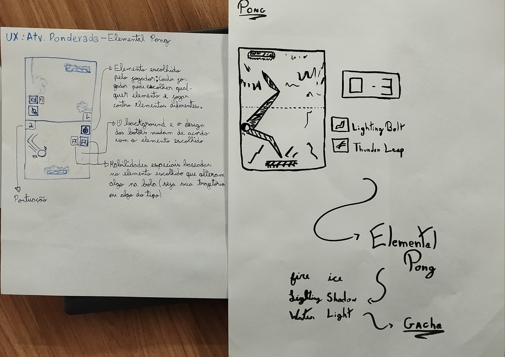
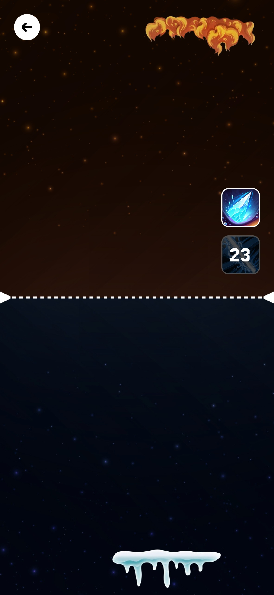
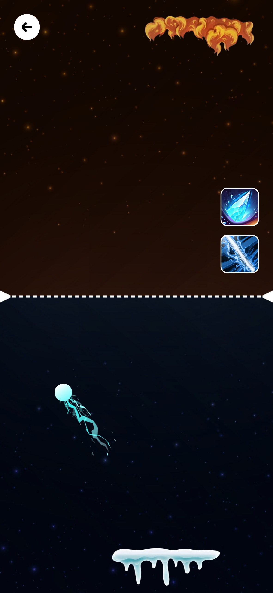
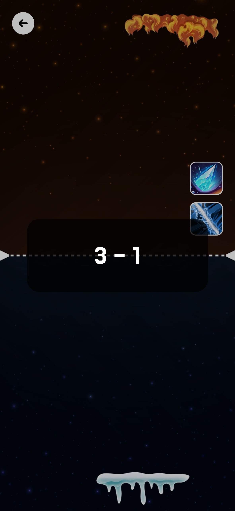

# Relatório - Reinventando Pong

## 1. Introdução  
O objetivo desta atividade é praticar os conceitos de Game Design, framework MDA e Concept Art por meio da reinvenção do jogo Pong.
A abordagem escolhida por nós foi ambos definirem um tema central para a reinvenção e, após isso, ambos desenharem concept arts de como imaginam essa versão.
 
---

## 2. Pesquisa e Análise Inicial  
O jogo original do Pong simula uma partida de tênis de mesa de forma simples, dividindo a tela em dois campos, com uma bola que percorre os campos e duas barras que representam as raquetes. Aplicando o MDA temos:
* Mecânicas: Movimento das barras e da bola, colição, um placar e uma regra de pontuação.
* Dinâmicas: Deve se ter reflexos rápidos e controle preciso da barra, além de adaptação à alteração da velocidade da bola.
* Estética: Competição intensa e satisfação ao marcar pontos, pois a partida reseta.

O que torna Pong um jogo envolvente e jogável é sua simplicidade e capacidade de gerar tensão entre os jogadores, além de aumentar a dificuldade gradualmente, impedindo o tédio. Sendo assim, seus principais elementos de diversão são: **a resposta rápida aos comandos e o fácil aprendizado**, e seus principais elementos de desafio são: **a necessidade de reflexos ágeis e adaptação ao aumento da velocidade da bola**. 

---

## 3. Proposta de Reinvenção  
A nossa versão do Pong se chama `Elemental Pong`, que é um pong com temática de elementos da natureza e habilidades especiais, aumentando a dinamicidade do Pong original. O jogador pode escolher um entre vários elementos da natureza para si e cada elemento possui duas habilidades especiais que podem alterar velocidade e trajetória da bola, aumentando a dificuldade do jogo.

*- **Tema e Ambientação:** Jogadores jogam pong entre si lançando habilidades elementais como Fogo, Água, Luz, Sombra, Raio, Vento, Gelo, e outros, entre si para vencer.*

*- **Personagens ou Elementos Visuais:** Uma partida possui dois campos, igual no Pong original, mas cada campo é personalizado com base no elemento escolhido pelo jogador.*

*- **Mudanças na Mecânica:** Cada player, após um tempo, pode lançar duas habilidades existentes com base no seu elemento escolhido e isso altera velocidade, trajetória, visual da bola, entre outros.*

*- **Objetivo da Reinvenção:** Aumentar a dificuldade e tornar o jogo mais diferente e emocionante a cada partida.*

#### Rascunho do Concept Art
A seguir está a folha da concept art que contem as ideias iniciais do jogo. Ela foi desenvolvida após a discussão acerda do tema da reinvenção e representa as visões de cada um de nós sobre a ideia inicial. Com as duas concept arts unidas, a ideia geral do jogo se torna completa.

    

---

## 4. Tela Digital do Jogo  
*- Como o concept foi adaptado para o formato digital?*

*- Quais elementos visuais foram aprimorados?*  

*- O uso de cores, formas e layout foi pensado para reforçar que aspectos do jogo?*  

<table style="border: 1px solid white; margin: 0 auto;">
    <tr>
        <td style="border: 1px solid white;"></td>
        <td style="border: 1px solid white;"></td>
        <td style="border: 1px solid white;"></td>
    </tr>
</table>

---

## 5. Reflexão e Aprendizados  

### Marcus
**1. Quais foram os maiores desafios enfrentados durante o processo de criação?**
Definitivamente foi a decisão sobre o tema do novo Pong e unir as ideias da dupla, criar uma ideia que não seja tão genérica ou simples não é muito fácil.

**2. Que habilidades foram desenvolvidas ou aprimoradas ao longo da atividade?** Foram desenvolvidas habilidades de adaptar de mecânicas clássicas para novas propostas, além de criatividade para ambientação e criação de habilidades especiais.

### José
**1. Quais foram os maiores desafios enfrentados durante o processo de criação?**
Pspspspspsp

**2. Que habilidades foram desenvolvidas ou aprimoradas ao longo da atividade?**
pspspspspsp

---
